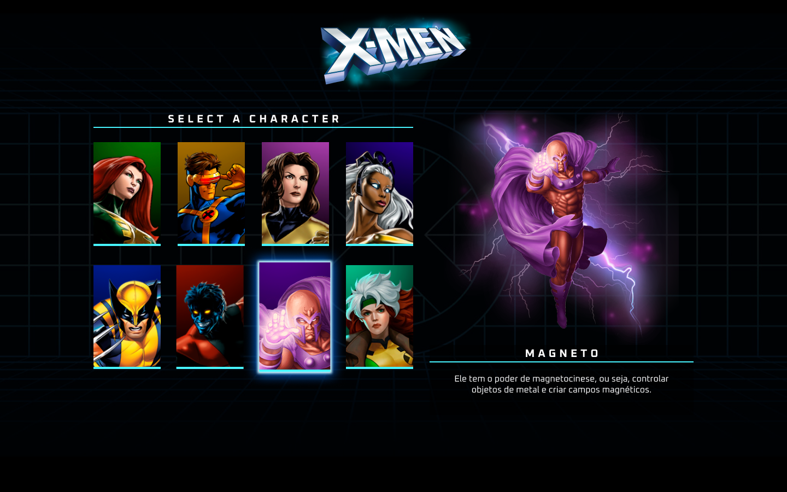

# Sobre o projeto
## Seletor de Personagens X-Men

Este projeto é um seletor interativo de personagens do X-Men, criado pela Dev em Dobro. Este seletor permite aos usuários navegar pelos diversos personagens do X-Men e visualizar informações detalhadas sobre cada um. Este projeto é perfeito para iniciantes procurando entender os conceitos básicos de HTML, CSS e JavaScript de uma maneira divertida e envolvente.

## Índice

- [Visão Geral](#visão-geral)
- [Requisitos](#requisitos)
- [Instalação](#instalação)
- [Como Usar](#como-usar)

## Visão Geral

Este projeto fornece uma interface limpa e interativa para navegar pelos personagens do X-Men. Quando um personagem é selecionado, os usuários podem ver informações detalhadas sobre o personagem, incluindo suas habilidades, história e outros detalhes.

## Requisitos

Este projeto requer conhecimento básico de HTML, CSS e JavaScript. Além disso, você precisará de um navegador moderno para visualizar e interagir com o projeto.

## Instalação

Para instalar este projeto, siga estas etapas:

1. Faça o fork deste repositório para sua conta no GitHub.
2. Clone o repositório para sua máquina local usando `git clone`.
3. Abra o arquivo `index.html` em seu navegador para visualizar o projeto.

## Como Usar

Após a instalação, você pode começar a usar o seletor de personagens X-Men. Aqui estão algumas dicas para começar:

- Navegue pelos personagens usando as setas para a esquerda e para a direita na tela.
- Clique em um personagem para ver mais detalhes sobre ele.
- Use a barra de busca na parte superior da tela para procurar um personagem específico.

## Contato

Para qualquer dúvida ou sugestão, sinta-se à vontade para entrar em contato conosco através da nossa página da empresa: Dev em Dobro.

---

Feito com ❤️ pela Dev em Dobro!
